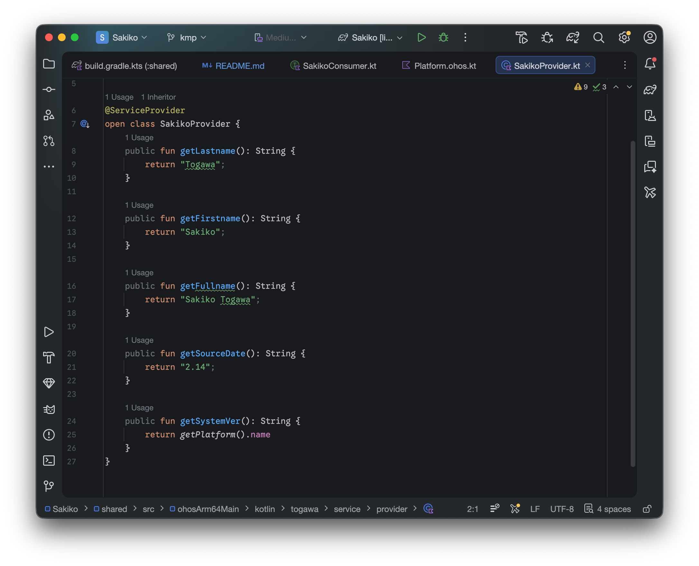
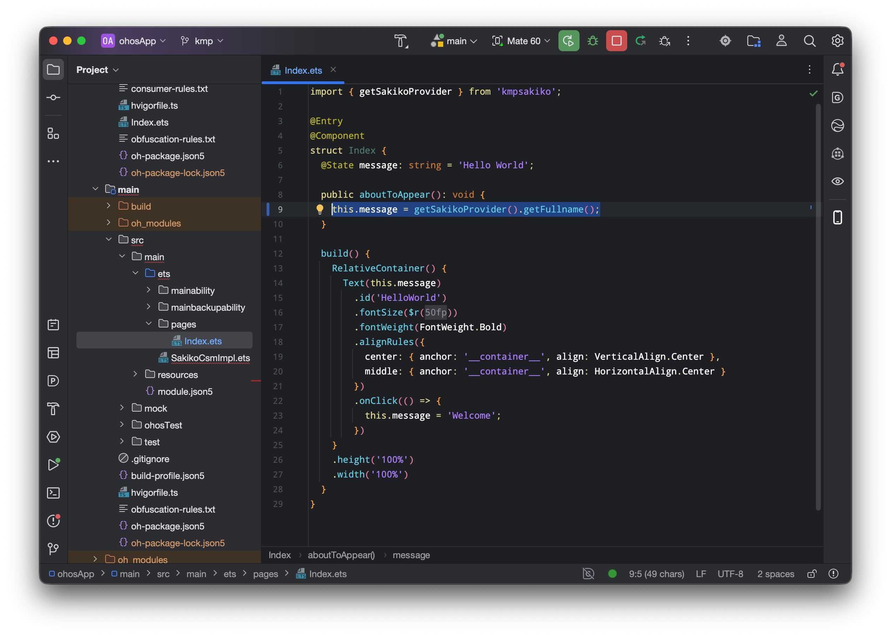
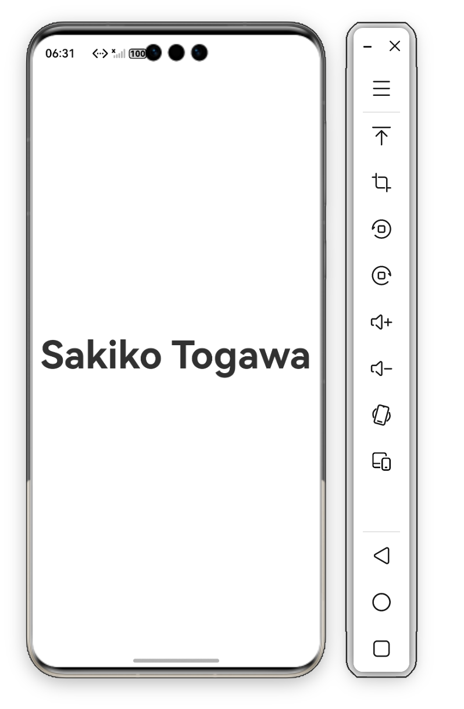
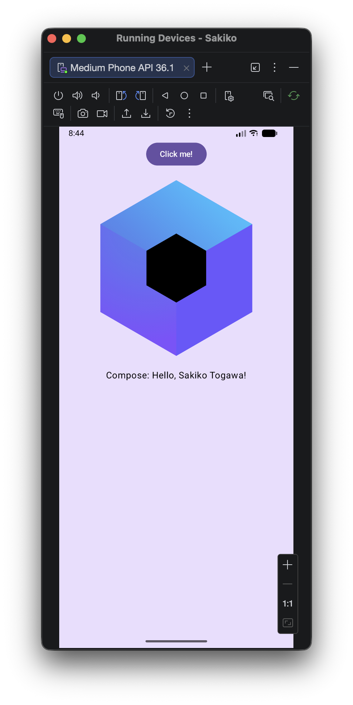
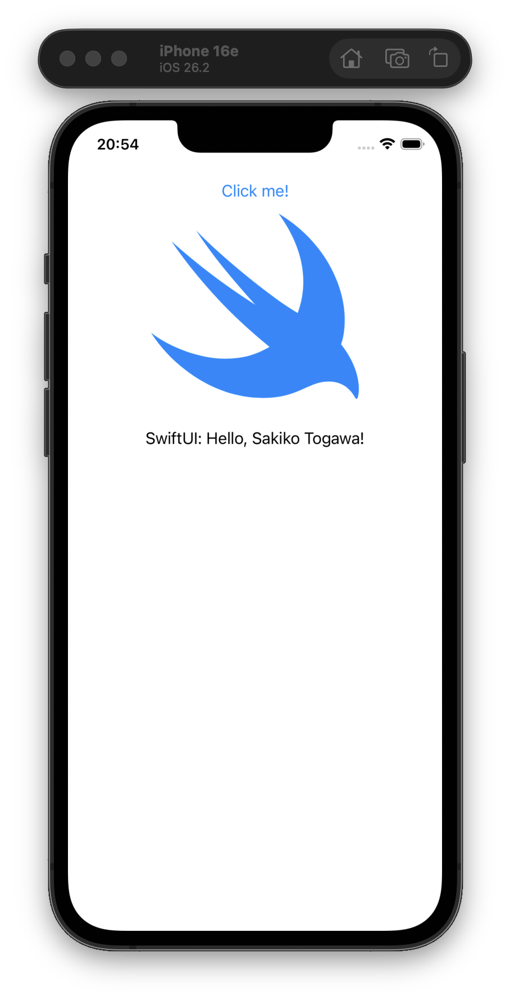
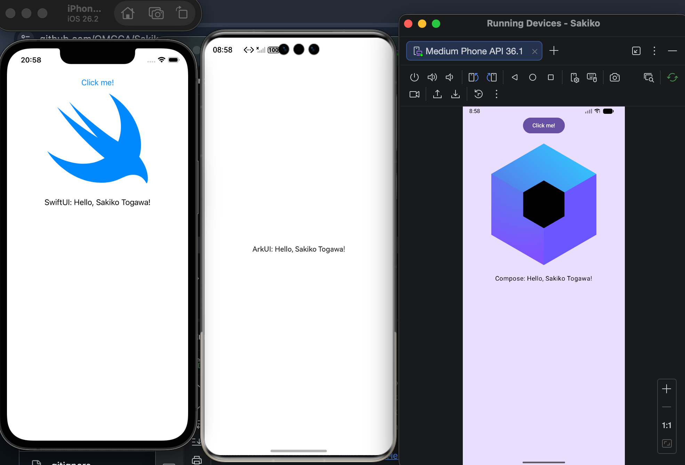

# Sakiko

## 直接看效果
A. 业务代码使用Kotlin实现


B. ArkTS代码通过knoi接口调用Kotlin代码


C. 运行结果
OHOS应用：


安卓应用：


iOS应用：


## 环境搭建踩过的坑
### Kotlin版本
整体方案依赖腾讯的Kuikly方案，所以需要用到一个定制的Kotlin版本（2.0.21-KBA-010）用于在gradle中声明OHOS构建任务；与此同时，由于最新Compose Multiplatform支持的最小Kotlin版本为2.1.0，所以相应的需要降级（本工程使用1.7.0，但由于本身也没考虑做UI多平台，所以只要能编译过就行）

同时需参考Kuikly开发文档声明腾讯maven仓才能拉取到上述Kotlin版本

[Kuikly开发文档参考](https://kuikly.tds.qq.com/DevGuide/kuiklybase-ohos-kn.html#%E4%BD%BF%E7%94%A8%E5%AE%9A%E5%88%B6%E5%8C%96kotlin%E7%89%88%E6%9C%AC)

本工程适配commit：1c99d68f994602824679f0b88511e6b3417211d1

### KMP工程构建任务配置
参考如下图配置手动配置构建任务


### 生成Kotlin/Native - ArkTS桥接代码需在KMP工程中声明knoi依赖
[接入参考](https://github.com/Tencent-TDS/KuiklyBase-components/blob/master/knoi/README-zh.md)

### d.ts的导出
直接将d.ts导出会频繁报```Failed to resolve OhmURL```错误，而knoi导出的consumer接口定义为d.ts，所以在gradle中声明了重命名操作将其改为ets，并在本仓内对应的KMPSakiko模块Index里导出
```groovy
tasks.register<Copy>("copyOhosCsm") {
    from("./build/ts-api/consumer.d.ts")
    into("../ohosApp/KMPSakiko/src/main/ets")
    rename("consumer.d.ts", "consumer.ets")
}
```
至于为什么会这样，懒得研究了
